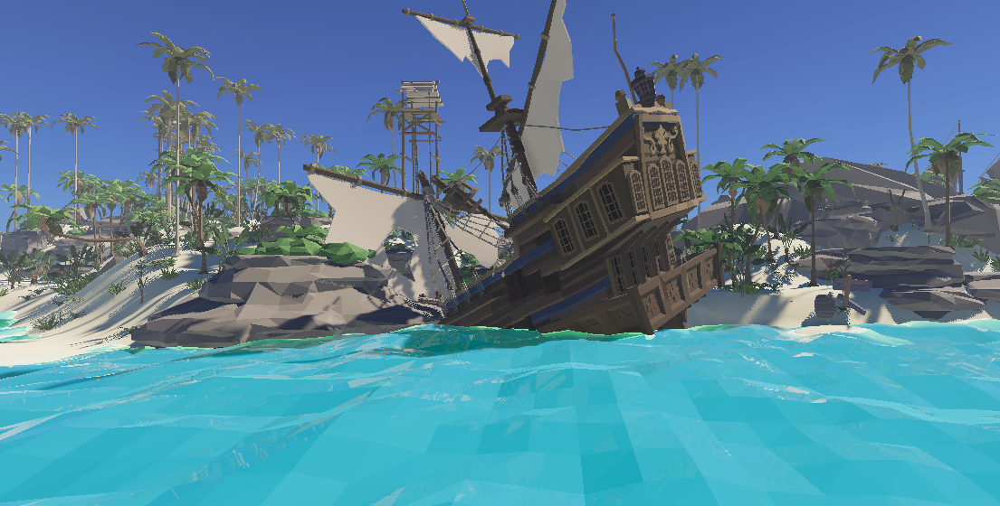
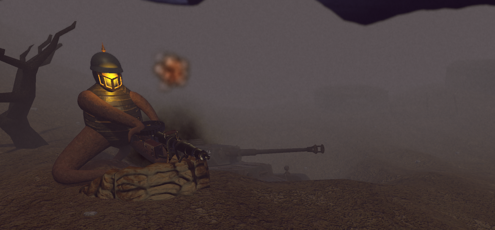
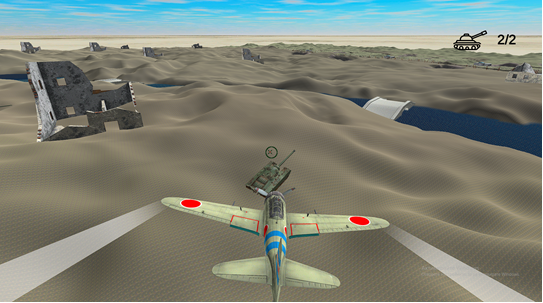

# UnityGames-NOIT

# Sea Men
## Download -> https://drive.google.com/file/d/1uvqR52S7byIXLFLJhRSK5O5V8gpeHfpw/view?usp=sharing

###  "Sea Men" is a game about pirates and British sailors battling on land and sea, racing to be the first to find the priceless treasure hidden in fortresses, caves, and tropical jungles. The players strategize and search for ways to overcome their opponents while having fun in the process.

# WW2 STORY
## Youtube video -> https://youtu.be/NPMtH-2ak8E

###  "WW2 STORY" is a multimedia application, presenting information about post-traumatic stress and its effects on veterans in the form of a game. Through which, the user can experience firsthand the psychological consequences of armed conflicts.

# MFS
## Download -> https://drive.google.com/file/d/19np8xW12UrUr7_Y7p-ma-etAwr9lxnuK/view?usp=sharing
## Youtube video -> https://youtu.be/E4ujp7nCxvA

###  "MFS" is a multimedia application containing information about military aircraft used during World War II, presented in the form of a game. Through which, the user can learn about the specifications of different aircraft and obtain more details about them.

